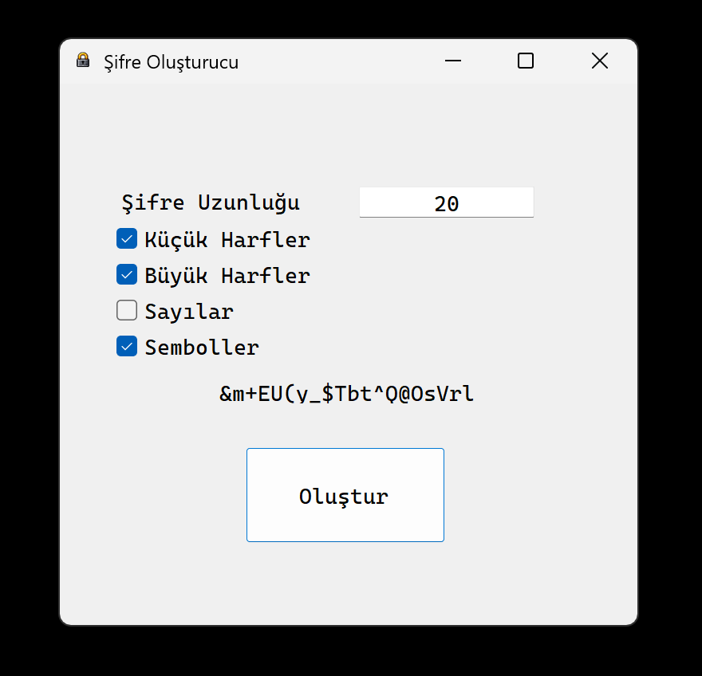

# Password Generator (Şifre Oluşturucu)

Bu proje, C# kullanılarak geliştirilmiş güvenli ve karmaşık şifreler oluşturmaya yarayan bir masaüstü uygulamasıdır. Siber güvenlik meraklıları ve güçlü şifre ihtiyacı duyan kullanıcılar için tasarlanmıştır.



## Özellikler

* **Tam Kontrol:** Şifre uzunluğunu belirleyebilme.
* **Karakter Setleri:** Büyük harf (A-Z), küçük harf (a-z), rakam (0-9) ve özel karakter (!@#) seçeneklerini dahil etme veya çıkarma.
* **Kolay Kullanım:** "Kopyala" butonu ile oluşturulan şifreyi tek tıkla panoya alma.
* **Güvenli:** Rastgelelik (Randomization) algoritmaları kullanılarak tahmin edilmesi zor şifreler üretir.
* **Teknoloji:** C# ve Windows Forms (.NET) altyapısı.

## Kurulum ve Çalıştırma

### Yöntem 1: Kaynak Kod ile Kurulum (Visual Studio ile)
Eğer kodları incelemek, değiştirmek veya Visual Studio üzerinden çalıştırmak istiyorsanız:

1.  **Projeyi Klonlayın:**
    Terminali açın ve aşağıdaki komutu girin:
    ```bash
    git clone https://github.com/yagizdll/Password-Generator.git
    ```

2.  **Projeyi Açın:**
    * İndirdiğiniz klasördeki `PasswordGenerator.slnx` dosyasına çift tıklayın.
    * Proje **Visual Studio** üzerinde açılacaktır.

3.  **Başlatın:**
    * Klavyeden `F5` tuşuna basın veya üst menüdeki yeşil **"Start"** butonuna tıklayın.
	
### Yöntem 2: Kaynak Kod ile Kurulum (dotnet ile)

1.	**Gereksinim**
	* Download .NET yazarak Microsoft'un sitesinden indirebilirsiniz.

2.  **Projeyi Klonlayın:**
    Terminali açın ve aşağıdaki komutu girin:
    ```bash
    git clone https://github.com/yagizdll/Password-Generator.git
    ```

3.  **Projeyi Derleyin ve Çalıştırın:**
    * Komut istemini (CMD) açın. Sırasıyla aşağıdaki komutları girin.
    
	```bash
	cd "Password-Generator/Password Generator"
	dotnet run
	```
	
### Yöntem 3: Hazır Programı İndirme (Kodla Uğraşmadan)
Kod veya derleme işlemiyle uğraşmak istemiyorsanız, programın bitmiş halini direkt indirip kullanabilirsiniz:

1. Bu sayfanın sağ tarafında bulunan **[Releases](https://github.com/yagizdll/Password-Generator/releases)** (Sürümler) başlığına tıklayın.

2. En güncel sürümün (Assets) altındaki `.zip` dosyasını indirin.

3. İndirdiğiniz ZIP dosyasına sağ tıklayıp **"Tümünü Ayıkla"** (Extract All) deyin.

4. Klasör içindeki `Password Generator.exe` dosyasına çift tıklayarak çalıştırın.

### Önemli Notlar

* **Windows Defender Uyarısı:** Programı ilk açtığınızda Windows mavi bir ekran çıkarıp *"Kişisel bilgisayarınız korundu"* diyebilir. Uygulamanın yayıncı imzası olmadığı için bu normaldir.
  * **Çözüm:** `Ek Bilgi` (More Info) > `Yine de Çalıştır` (Run Anyway) butonuna basarak açabilirsiniz.

* **Açılmama Sorunu:** Eğer EXE dosyasına tıkladığınızda hiçbir şey olmuyorsa, bilgisayarınızda **.NET Desktop Runtime** eksik olabilir.
  * **Çözüm:** Microsoft'un sitesinden **.NET Desktop Runtime 10.0** indirip kurduğunuzda sorun düzelecektir.


##	Lisans
Bu proje [MIT](LICENSE) lisansı altında lisanslanmıştır.

---
**Geliştirici:** Yağız Eren Kotan  
Sorularınız için [GitHub Profilim](https://github.com/yagizdll) üzerinden ulaşabilirsiniz.